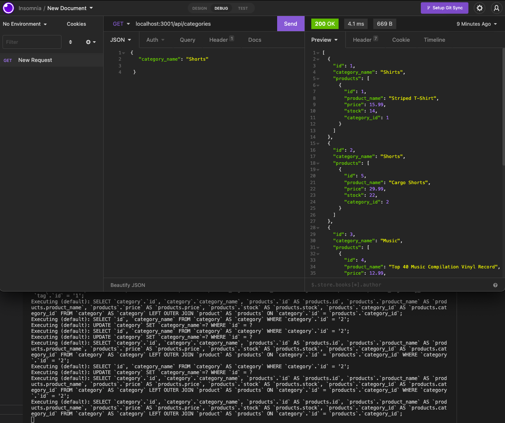

[](https://opensource.org/licenses/MIT)

# E-Commerce
https://github.com/conneriraola/e-commerce


## Description
Building a back end for an e-commerce site. 


## Table of Contents
* [Screenshot](#screenshot)
* [Installation](#installation)
* [Usage](#usage)
* [License](#license)
* [Questions](#questions)


## Screenshot: 

    

## Installation 
Access MySql in terminal, run schema file and then exit MySql. Enter "npm start" and then "npm run seed".

## Usage
[Video link](https://drive.google.com/file/d/1kpaIylQCRQZ8troqrfTK4CQbo0v8BatH/view?usp=sharing)

## User Story
```md
AS A manager at an internet retail company
I WANT a back end for my e-commerce website that uses the latest technologies
SO THAT my company can compete with other e-commerce companies
```

## Acceptance Criteria
```md
GIVEN a functional Express.js API
WHEN I add my database name, MySQL username, and MySQL password to an environment variable file
THEN I am able to connect to a database using Sequelize
WHEN I enter schema and seed commands
THEN a development database is created and is seeded with test data
WHEN I enter the command to invoke the application
THEN my server is started and the Sequelize models are synced to the MySQL database
WHEN I open API GET routes in Insomnia for categories, products, or tags
THEN the data for each of these routes is displayed in a formatted JSON
WHEN I test API POST, PUT, and DELETE routes in Insomnia
THEN I am able to successfully create, update, and delete data in my database
```


## License
MIT
[(https://opensource.org/licenses/MIT)


## Questions
* Git Hub Username: conneriraola
* Github profile: https://github.com/conneriraola
* conner_iraola@yahoo.com